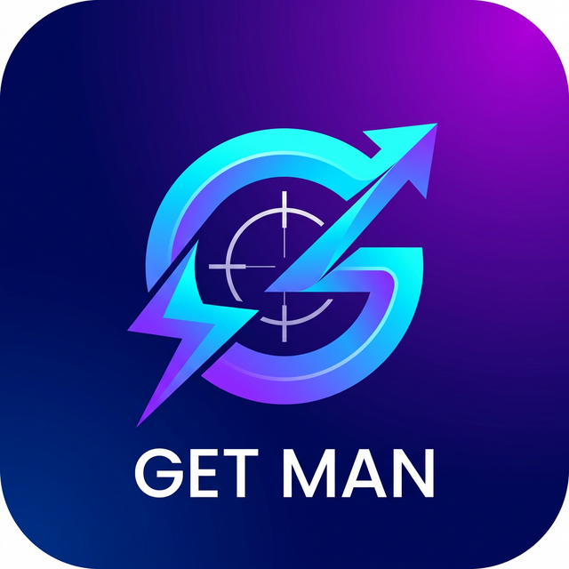

<div align="center">
  
  <h1>GET MAN</h1>
  <p><b>A modern, lightning-fast, sleek API Client for Desktop.</b></p>
  
  [](https://github.com/eder-ferraz-caciano/GET_MAN/releases/latest)
  [](LICENSE)
</div>

<br/>

GET MAN is a powerful developer tool built with Tauri, React, and TypeScript. It is designed to be a lightweight and highly responsive alternative to traditional bloated API clients, featuring an immersive glassmorphism UI, a powerful variables resolution engine, and dynamic folder-level scripting.

<div align="center">
  <br/>
  
  <p><i>(Troque esta imagem por um Print real do seu app rodando)</i></p>
  <br/>
</div>

## ✨ Highlighted Features

- ⚡ **Lightweight & Fast:** Built entirely in Rust (Tauri) & React. Loads instantly.
- 🌍 **Environments & Globals:** Full support for `{{variables}}` at the environment, global, and folder scope.
- 🔐 **Pre-request JS Scripts:** Drop vanilla JavaScript inside any Folder to automatically run login routines (`fetch()`) and inject Tokens (`getman.setEnv()`) into environments.
- 🎨 **CodeMirror Native:** Full syntax highlighting for Javascript setup scripts and JSON payloads with the OneDark theme.
- 🕵️ **Console Trace:** In-depth debugging panel that logs URLs, Headers, Queries, Payloads, and API responses.
- 💾 **Local Offline Storage:** Your workspace and environments are securely auto-saved using Chromium's local storage.
- 📦 **Export & Import:** Export your entire workspace into a `.json` file and share it with your team.

---

## 🚀 Download & Installation

The simplest way to install GET MAN is by downloading the compiled `.exe` files from the **GitHub Releases** page.

> **[⬇️ Download the latest Windows version (.exe)](https://github.com/eder-ferraz-caciano/GET_MAN/releases/latest)**

*(Note: Replace `eder-ferraz-caciano` with your actual GitHub username)*

---

## 💻 Building from Source (For Developers)

If you're a developer and want to run or build GET MAN locally:

### Prerequisites:
- Node.js (v18+)
- Yarn or npm
- Rust compiler and Cargo (`rustup`)
- Tauri CLI dependencies for Windows (Visual Studio Build Tools)

### Installation:

1. Clone the repository:
```bash
git clone https://github.com/eder-ferraz-caciano/GET_MAN.git
cd GET_MAN
```

2. Install front-end dependencies:
```bash
yarn install
```

3. Run the development environment:
```bash
yarn tauri dev
```

4. Build the final `.exe` installer:
```bash
yarn tauri build
```
Once the build concludes, your installer and `.exe` will be generated inside the `src-tauri/target/release/bundle` directory.

---

## 🤝 Contributing
Contributions, issues, and feature requests are welcome!

## 📝 License
This project is [MIT](LICENSE) licensed.
